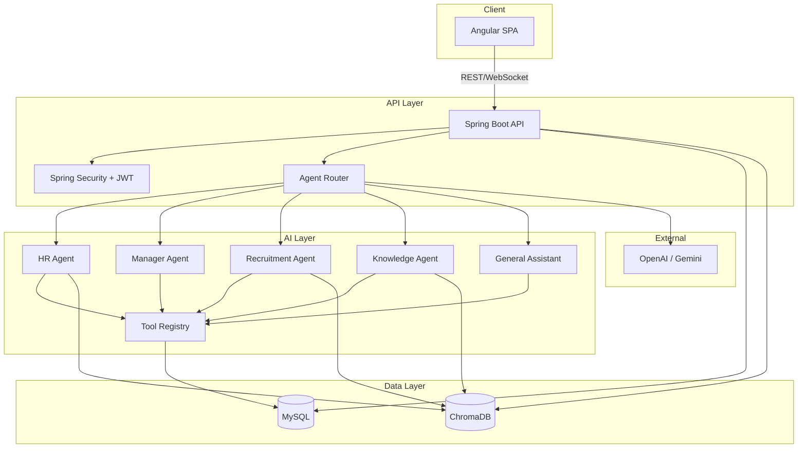
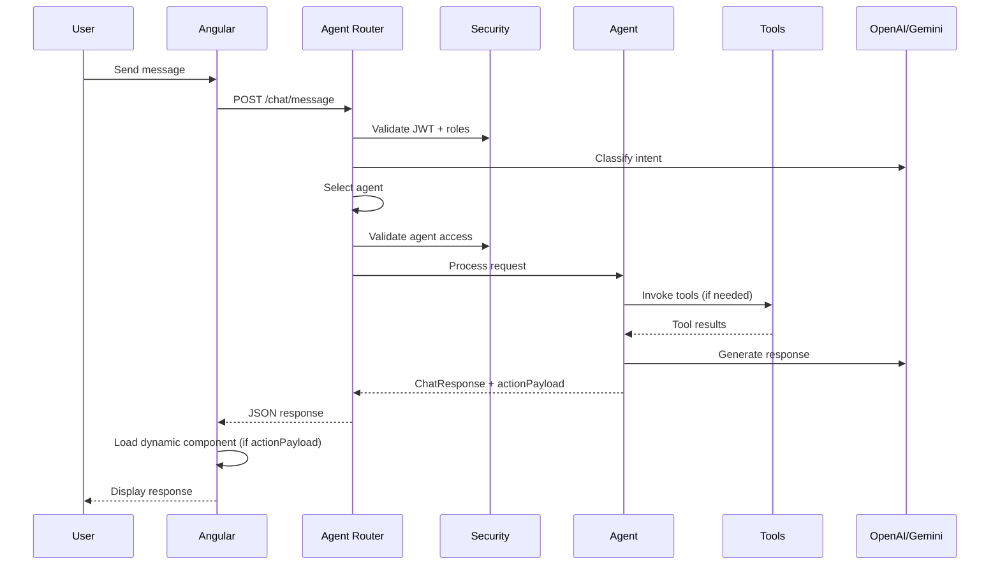
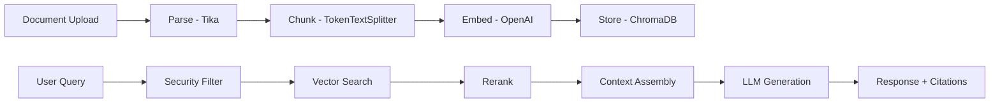

# Architecture Documentation

Enterprise Knowledge Assistant — system architecture, design decisions, and diagrams.

## System Overview

The EKA platform is a monorepo consisting of a Spring Boot backend, Angular frontend, MySQL database, and ChromaDB vector store, orchestrated via Docker Compose.

## Architecture Diagram



## Agent Router Flow



## RAG Pipeline



## Clean Architecture (Backend)

```
┌─────────────────────────────────────────┐
│              Controllers                 │  ← REST API, WebSocket
├─────────────────────────────────────────┤
│              Services                    │  ← Business logic
├─────────────────────────────────────────┤
│         Agents / RAG / Tools             │  ← AI layer
├─────────────────────────────────────────┤
│            Repositories                  │  ← Data access
├─────────────────────────────────────────┤
│              Entities                    │  ← Domain models
└─────────────────────────────────────────┘
```

## Role-Based Access Matrix

| Resource | CEO | HR | Manager | Employee | External |
|----------|-----|----|---------|----------|----------|
| All employees | ✓ | ✓ | Team only | Self | ✗ |
| HR policies | ✓ | ✓ | ✓ | ✓ | ✗ |
| Confidential docs | ✓ | ✓ | ✗ | ✗ | ✗ |
| Approvals | ✓ | ✓ | Own team | ✗ | ✗ |
| Job listings | ✓ | ✓ | ✓ | ✓ | ✓ |
| Analytics (org) | ✓ | ✓ | ✗ | ✗ | ✗ |
| Analytics (team) | ✓ | ✓ | ✓ | ✗ | ✗ |

## Design Decisions

See [decisions/](decisions/) for Architecture Decision Records (ADRs).

## Sequence Diagrams

See [sequence/](sequence/) for detailed interaction flows.
