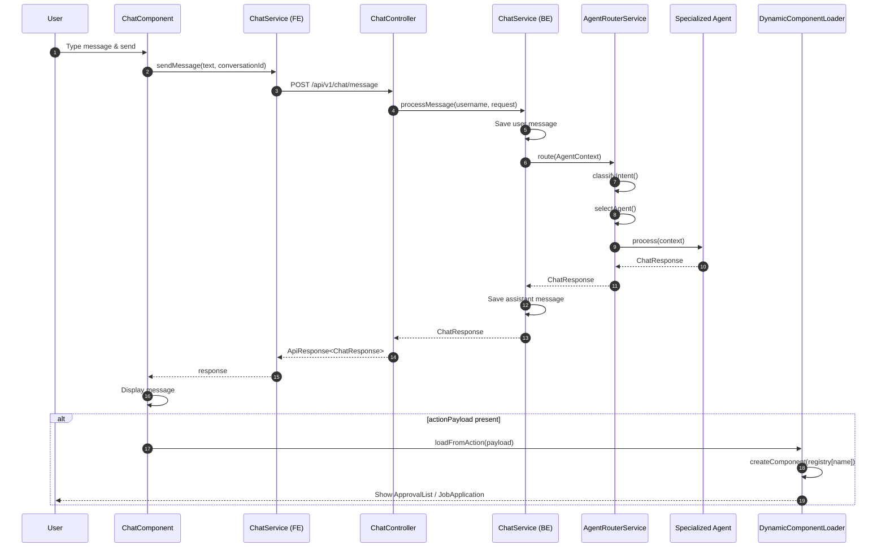

# Chat Message Flow — Sequence Diagram

## Key Points

1. User messages persisted before agent processing
2. Agent Router is the single entry point for all AI interactions
3. Action payloads trigger dynamic UI components without page navigation
4. Citations included when Knowledge Agent uses RAG retrieval
