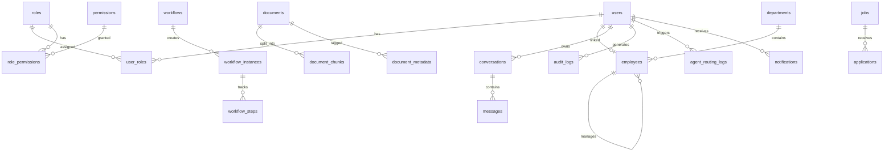

# Database Schema

Enterprise Knowledge Assistant — MySQL database design.

## ER Diagram

## Core Tables

| Table | Purpose |
|-------|---------|
| users | Authentication and profile |
| roles | RBAC roles (CEO, HR, MANAGER, EMPLOYEE, EXTERNAL) |
| permissions | Granular permissions |
| employees | Employee records with org hierarchy |
| departments | Organizational structure |
| documents | Uploaded documents for RAG |
| document_chunks | Text chunks with vector references |
| conversations | Chat sessions |
| messages | Individual chat messages |
| workflows | Workflow definitions |
| workflow_instances | Active workflow instances |
| jobs | Job postings |
| applications | Job applications |
| audit_logs | Security and activity audit trail |
| agent_routing_logs | AI routing decisions |

## Migrations

Flyway migrations in `backend/src/main/resources/db/migration/`:

- `V1__initial_schema.sql` — Core tables and seed roles

## Seed Data

Test data available in [test-data/](../test-data/).

## Document Classification

Documents use classification levels for RAG security:

| Level | Accessible By |
|-------|--------------|
| PUBLIC | All roles including EXTERNAL |
| INTERNAL | CEO, HR, MANAGER, EMPLOYEE |
| CONFIDENTIAL | CEO, HR |
| RESTRICTED | CEO only |
